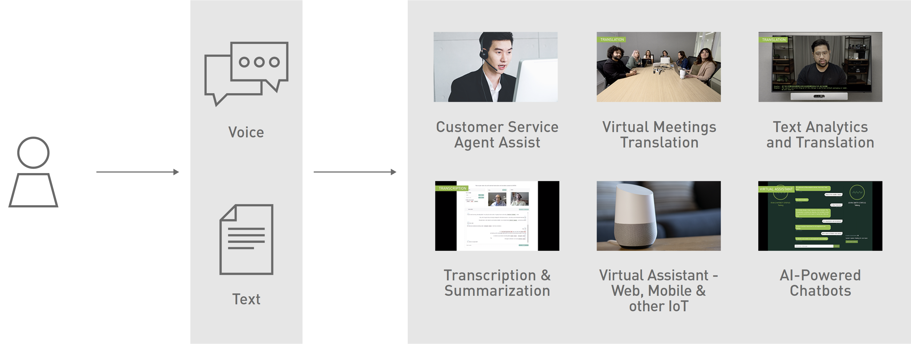
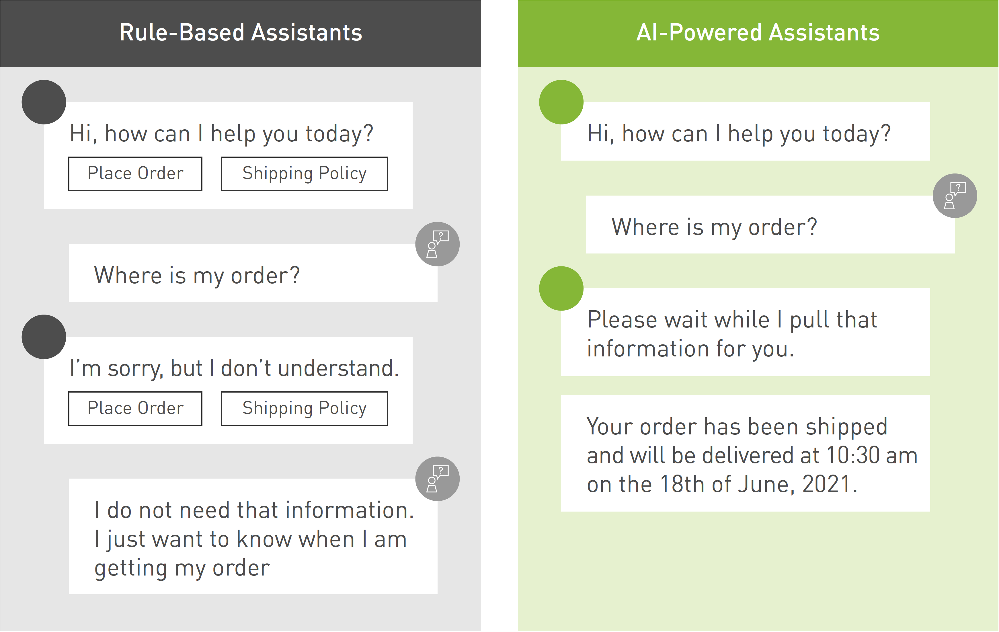
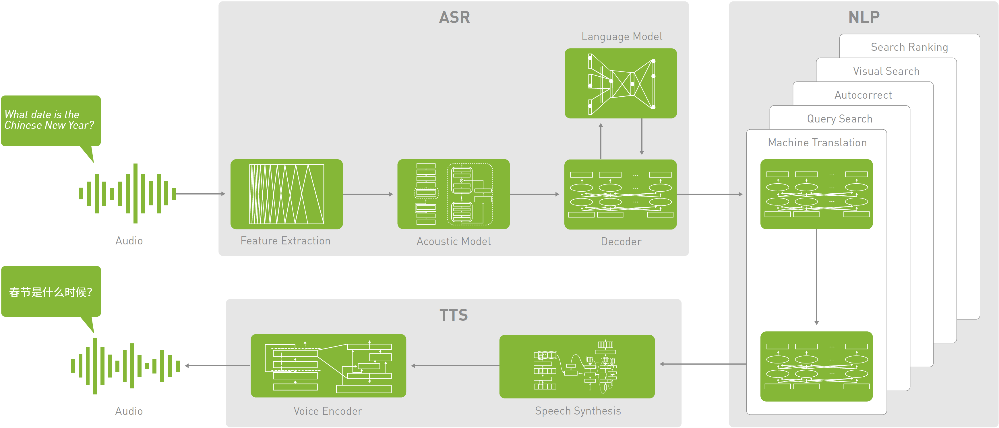

# Riva Speech Skills

[NVIDIA® Riva](https://developer.nvidia.com/riva) provides state-of-the-art models, fully accelerated pipelines, and tools to easily add Speech AI capabilities to real-time applications like virtual assistants, call center agent assist, and video conferencing. Riva components are customizable, so you can adapt the applications for your use case and industry and deploy them in any cloud, on-premises, and at the edge.

- [Riva Speech Skills](#riva-speech-skills)
  - [What is Conversational AI](#what-is-conversational-ai)
  - [Evolution of Conversational AI](#evolution-of-conversational-ai)
    - [Rule-Based Assistants](#rule-based-assistants)
    - [AI-Powered Assistants](#ai-powered-assistants)
  - [How a Conversational AI System Works](#how-a-conversational-ai-system-works)
  - [Conversational AI Applications Requirements](#conversational-ai-applications-requirements)
    - [High performance and scalability](#high-performance-and-scalability)
    - [High Accuracy](#high-accuracy)
    - [Multilingualism](#multilingualism)
    - [Security and Privacy](#security-and-privacy)
  - [Enterprise Support](#enterprise-support)
  - [Test a Deployment](#test-a-deployment)
    - [Requirements](#requirements)
    - [Helm Configuration Options](#helm-configuration-options)
    - [Helm Deployment Example](#helm-deployment-example)

## What is Conversational AI

Conversational AI is the application of machine learning to develop language-based apps that allow humans to interact naturally with devices, machines, and computers using speech. It refers to applications that automate human conversations with chatbots and virtual assistants in real time. For example, let’s say you are driving and you need to know where the nearest gas station is. Typically, you would manually click on your phone map and search for the information while still trying to ensure you are driving safely. A more natural way to interact with your phone map is to say, "Navigate to the nearest gas station” and your map automatically navigates to the desired location. This interaction prevents distracted driving and reduces contact with the mobile device. Enterprises frequently use virtual assistants for simpler routine customer service tasks such as checking bank balances or resolving customer queries, while their human agents are free to handle more complex issues.

The simplest example of conversational AI is a question and answer machine, commonly known as a chatbot. A chatbot is a software application that communicates with a user in natural language over the phone, messaging applications on websites, mobile apps, and so on. We have interacted with these applications during customer service phone calls or FAQ chat sessions. New deep learning-based conversational AI applications are being introduced every day, from voice assistants and AI-powered chatbots, to question answering systems that enhance customer service. Other popular applications are virtual assistants and multi-speaker transcription. Virtual assistants based on AI have come a long way in interacting with customers in a human-like way.


<sup>Figure 1: Conversational AI Applications</sup>

Essentially a conversational AI application is a complex system that integrates multiple deep neural networks that must work in unison to deliver a delightful user experience with accurate, fast, and natural human-to-machine interaction. The aim of conversational AI is to make machine conversations virtually indistinguishable from how a human would converse. The next section describes the historical evolution of conversational AI.

## Evolution of Conversational AI

In the 1950s, Alan Turing came up with a game that he called the imitation game to test a machine's ability to exhibit intelligent behavior that is indistinguishable from that of a human. The Turing test as we know it is considered by many to be the basis of chatbot development.

### Rule-Based Assistants

The first chatbot software named Eliza was developed by the Artificial Intelligence Laboratory at MIT by Joseph Weizenbaum in 1966. Eliza is a computer program that uses pattern matching and substitution technology to simulate a Rogerian psychotherapist. Users type in words into the textbased platform, and responses are based on scripted templates. Like Eliza, the first-generation chatbots are rule-based: they use pattern matching techniques to map the user input to a predefined answer from a set of responses. Developers map out conversations through a flowchart, defining how the chatbot should respond to questions they think customers might ask. These responses based on predefined rules are written in languages such as Artificial Intelligence Markup Language (AIML)[1], Rivescript[2], Chatscript[3], and so on. Rule-based chatbots are used as FAQ agents, such as answering simple questions before connecting to live agents or answering common questions about a particular situation.

Rule-based systems have several limitations in both development and interaction phases.

- Designing the application is a manual process, and it requires programming every response to a question; hence they work well for only the scenarios they are trained for.
- It is difficult for a developer to capture all the possible responses; hence these chatbots cannot catch grammatical and syntactic errors in users' responses leading to misunderstanding and can cause frustration.
- They do not learn through interactions, create new answers, hence they are not intelligent.

Although rule-based systems are faster to execute, they do not understand context or intents; hence interactions feel more robotic than conversational. We have all gotten frustrated at one point or another talking to automated systems that do not know what we want. Over time, the demand for intelligent, real-time, and personalized interactions for customers' support services and to meet employees' and individuals' expectations increased significantly. Consequently, rule-based chatbots evolved to AI-powered chatbots with advanced features, including human-like voice, intent extraction, sentiment analysis, contextual semantic search, grammatical analysis, learning over time, and scalability among others.

### AI-Powered Assistants

Unlike rule-based systems, AI-based systems are designed to enable lifelike conversations and extract contextual information using natural language processing from users' input and learn from the history of conversations. In the last few years, deep learning has improved the state-ofthe-art in conversational AI and offered superhuman accuracy on certain tasks. Deep learning has also reduced the need for deep knowledge of linguistics and rule-based techniques for building language services, which in turn has led to widespread adoption across industries like telecommunications, finance, healthcare and retail.

A typical intelligent conversation can take multiple turns (or multi-turns) and can be highly contextual. Simple queries such as "What is the weather today?”, "Turn on the light”, or "Set a reminder for 6:00 am tomorrow” can be done in a single conversation turn - one back-and-forth interaction. These queries are simple, require little to no input, and can be answered with just one response. However, users want to have long, back-and-forth, multi-turn conversations in one or multiple contexts. This is crucial for complex situations with a lot of input like booking a flight, making recommendations, or ordering food. Multi-turn allows customers to interrupt, ask questions not related to the current context, or change their minds about their request in the middle of a conversation.


<sup>Figure 2: Rule-based Assistant vs. AI-Powered Assistant</sup>

The next generation of conversational AI applications are equipped to handle multi-turn, multidomains, and multi-user conversations. Using advanced speech and natural language technology, virtual assistants are able to navigate the complex dynamics of the history of conversations and identify the correct intent, domain, or context to drive the conversations towards a successful outcome. In addition, individual virtual assistants can be connected to a universal assistant to handle multiple domain-related tasks. For example, an employee can receive requests relating to sales, HR, and customer service. A universal virtual assistant takes these multi-domain questions and determines which of the linked bots to answer these questions. This eliminates the need for users to interact with different virtual assistants for different tasks, thereby improving the customers’ experience and overall productivity of the employees.

Conversational AI applications require multiple deep learning models to work in a pipeline and or in parallel to deliver high-quality results within a low latency budget. This adds complexity which in turn fuels the need for computing resources both for training and deployment. GPUs provide the compute power and are key resources in building and deploying state-of-the-art conversational AI to power applications and delivering highly accurate and low-latency systems. The next section describes how conversational AI works.

## How a Conversational AI System Works

Conversational AI combines various technologies such as Automatic Speech Recognition (ASR), Natural Language Processing (NLP), Text-to-Speech (TTS), and dialog management to learn, understand, remember, and respond to different interactions. Typically, the conversational AI pipeline consists of three stages:

- Automatic Speech Recognition (ASR)
- Natural Language Processing (NLP)
- Text-to-Speech (TTS)


<sup>Figure 3: Conversational AI Pipeline</sup>

First, the raw audio waveform serves as an input to the ASR model. At the ASR stage, the audio is processed and transcribed to text. Second, the application needs to understand what the text means, hence, the output from the ASR stage is passed to the NLP stage. This text is then interpreted, and the application generates a smart response during the NLP stage. Finally, the text is converted into speech signals to generate audio for the user during the TTS stage. This is the artificial production of human speech from text. Several deep learning models are connected to this pipeline to build a conversational AI application. These models employ deep learning techniques responsible for learning and improving the application over time.

There are several freely available datasets to train models for conversational AI tasks. Over time, the size of models and the number of parameters used in conversational AI models has grown. BERT (Bidirectional Encoder Representations from Transformers), a popular language model, has 340 million parameters. Training such models can take weeks of compute time and is usually performed using deep learning frameworks, such as PyTorch, TensorFlow, and MXNet on GPUs. Models trained on public datasets rarely meet the quality and performance expectations of enterprise apps as they lack context for the industry, domain, company, and products.

One approach to address these challenges is to use transfer learning. You can start from a model that was pre-trained on a generic dataset and apply transfer learning and fine-tuning needed for specific use cases using a small amount of additional data. Fine-tuning is far less computeintensive than training the model from scratch.

During inference, several models need to work together to generate a response for a single query, requiring the latency for a single model to be only a few milliseconds. GPUs are used to train deep learning models and perform inference because they can deliver 10x higher performance than CPU-only platforms. This makes it practical to use the most advanced conversational AI models in production.

The technology behind conversational AI is complex, involving a multi-step process that requires a massive amount of computing power and several deep learning models that must run in less than 300 milliseconds to deliver human-like results. The next section describes other challenges in building conversational AI applications.

## Conversational AI Applications Requirements

Conversational AI is highly beneficial, however, there are several challenges to building universal, real-time, and intelligent conversational AI applications. This section discusses the requirements and challenges involved in building conversational AI applications.

### High performance and scalability

For an engaging and high quality conversation between a human and a machine, responses have to be quick, intelligent, and natural sounding. This poses the following challenges:

- Computations on approximately 30 deep learning models, with hundreds of millions of parameters must take place in under 300 ms.
- Trade-offs between quick responses and quality of the response need to be considered.
- Increase in latency due to hundreds of millions of concurrent users must be accounted for.

High computing power and highly optimized conversational AI software and libraries ensure high performance and low latency both of which are essential to any conversational AI application.

### High Accuracy

Human language is very complex, contextual, and nuanced. Every statement builds on shared context and previous interactions. From inside jokes to cultural references and wordplay, humans speak in highly nuanced ways without skipping a beat. Each response follows the last, almost instantly. Friends anticipate what the other will say before words even get uttered. These are key features for conversations to be natural, hence an important issue to address when building conversational AI.

### Multilingualism

There are over 6500 spoken languages in the world apart from English. Language diversity and factors such as accent, dialects, pronunciation, even words and phrases with multiple meanings based on how they sound, slang, and so on must be learned by the system. Users would gain more trust in these applications when they are able to communicate in their mother language. Therefore, gathering diverse training data from different regions and considering cultural differences is a key component in developing a universal application.

### Security and Privacy

Ensuring data are securely processed and stored is crucial when building conversational AI applications. Organizations must define and ensure high-security standards and ensure privacy when planning to build conversational AI applications to gain customers’ trust. There should be transparency in how the data is being used by the organization to address privacy concerns.

In summary, building a real-time and high-quality conversational AI application with little upfront investment comes with several challenges and ensuring that these challenges are addressed is the key to making advances in conversational AI.

## Enterprise Support

NVIDIA Riva Enterprise provides paid enterprise subscriptions for Automatic Speech Recognition and Text-To-Speech. NVIDIA offers Riva Enterprise subscriptions for ASR and TTS and can be purchased with either a 1-year or 3-year term. Each subscription provides a certain amount of licensed usage of either ASR or TTS that can be consumed during the term. All subscriptions include technical support.
Riva Enterprise also includes:

- Unlimited usage on any cloud and on-prem
- Prioritization of bug fixes and issue resolution
- Access to NVIDIA AI experts during local business hours for guidance on configurations and performance
- Long-term support for designated versions to control your maintenance and upgrade schedule
- Priority access to all new software patches, upgrades, and maintenance releases
- Rapid response and timely issue resolution; remote cases are accepted 24/7 globally

[Try Riva Enterprise for Free!](https://www.nvidia.com/en-us/ai-data-science/products/riva-enterprise/free-trial/)

## Test a Deployment

NVIDIA Riva is a fully accelerated speech AI SDK that’s available freely to all members of the NVIDIA Developer Program on NGC. Riva can be deployed free of charge up to a certain usage limit. Riva Enterprise is a paid subscription program for organizations looking to deploy Riva-based applications beyond the free limit with enterprise-grade support.

### Requirements

1. [Kubernetes Cluster with NVIDIA GPU Operator](https://docs.nvidia.com/datacenter/cloud-native/gpu-operator/install-gpu-operator-nvaie.html)
2. [Helm](https://helm.sh/docs/intro/install/)
3. Worker Node at least one NVIDIA GPU >= 16Gb (Amphere, Volta, Tesla)
4. ~64Gb [Persistent Volume Claim](https://kubernetes.io/docs/concepts/storage/persistent-volumes/#persistentvolumeclaims) Access for model storage
5. [NVIDIA NGC Account](https://catalog.ngc.nvidia.com/)
6. Assistant container images (`docker-compose.yaml` incluced) available to worker node
7. [Prometheus](https://github.com/NVIDIA/deepops/blob/master/scripts/k8s/deploy_monitoring.sh)
8. NodePort Access for GUI/Demo

### Helm Configuration Options

- Autoscaling with Prometheus Adapter Monitoring and Triton Metrics Server
- Load Balancing with Traefik (Local dev example)
- Demo Workload job to test configurations
- Available Demos:
  - [Weather Assistant](https://docs.nvidia.com/deeplearning/riva/user-guide/docs/samples/weather.html)
  - [Call Center Assistant](https://docs.nvidia.com/deeplearning/riva/user-guide/docs/samples/callcenter.html)
  - [Interactive Web GUI](https://tbyb.rivaspeech.com/)
- NVIDIA Pre-Trained Models fron NGC (`*.rmir`)
  - Text-to-Speech
  - Automatic Speech Recognition
  - Natural Language Processing

All configurations may be modified directly or at installation using the `riva-tbyb/values.yaml` file.

### Helm Deployment Example

```bash
MODEL_KEY_STRING=tlt_encode
MODEL_DEPLOY_KEY=$(echo -n $MODEL_KEY_STRING | base64 -w0)
NGC_EMAIL=<NGC_EMAIL>
NGC_API_KEY=<NGC_API_KEY>

helm upgrade --install riva-tbyb riva-tbyb \
    --dependency-update \
    --set ngcCredentials.password=$NGC_API_KEY \
    --set ngcCredentials.email=$NGC_EMAIL \
    --set modelRepoGenerator.modelDeployKey=$MODEL_DEPLOY_KEY \
    --set assistant.weatherStackAPIKey=$WEATHER_STACK_API_KEY
```
